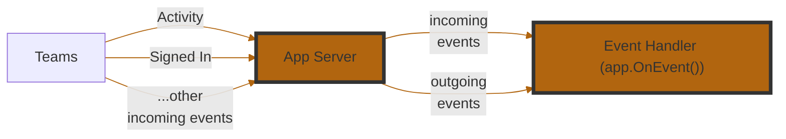

<!-- mermaid-diagram -->



<!-- events-table -->

| **Event Name**      | **Description**                                                                |
| ------------------- | ------------------------------------------------------------------------------ |
| `start`             | Triggered when your application starts. Useful for setup or boot-time logging. |
| `signin`            | Triggered during a sign-in flow via Teams.                                     |
| `error`             | Triggered when an unhandled error occurs in your app. Great for diagnostics.   |
| `activity`          | A catch-all for incoming Teams activities (messages, commands, etc.).          |
| `activity.response` | Triggered when your app sends a response to an activity. Useful for logging.   |
| `activity.sent`     | Triggered when an activity is sent (not necessarily in response).              |

<!-- example-1 -->

```csharp
app.OnError((sender, @event) =>
{
    // do something with the error
    app.Logger.Info(@event.Exception.ToString());
});
```

<!-- example-2 -->

When an activity is received, log its `JSON` payload.

```csharp
app.OnActivity((sender, @event) =>
{
    app.Logger.Info(@event.Activity.ToString());
});
```
