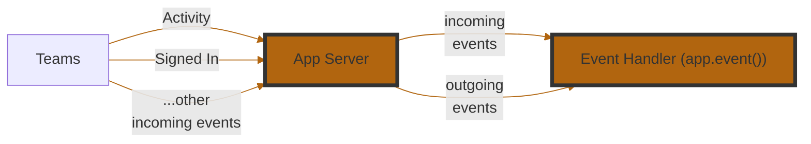

<!-- mermaid-diagram -->



<!-- events-table -->

| **Event Name**      | **Description**                                                                |
| ------------------- | ------------------------------------------------------------------------------ |
| `start`             | Triggered when your application starts. Useful for setup or boot-time logging. |
| `sign_in`           | Triggered during a sign-in flow via Teams.                                     |
| `error`             | Triggered when an unhandled error occurs in your app. Great for diagnostics.   |
| `activity`          | Triggered for all incoming Teams activities (messages, commands, etc.).        |
| `activity_response` | Triggered when your app sends a response to an activity. Useful for logging.   |
| `activity_sent`     | Triggered when an activity is sent (not necessarily in response).              |

<br/>
:::info
Event handler registration uses `@app.event("<event_name>")` with an async function that receives an event object specific to the event type (e.g., `ErrorEvent`, `ActivityEvent`).
:::

<!-- example-1 -->

```python
@app.event("error")
async def handle_error(event: ErrorEvent):
    """Handle error events."""
    print(f"Error occurred: {event.error}")
    if hasattr(event, "context") and event.context:
        print(f"Context: {event.context}")
```

<!-- example-2 -->

When an activity is received, log its payload.

```python
@app.event("activity")
async def handle_activity(event: ActivityEvent):
    """Handle activity events."""
    print(f"Activity received: {event.activity}")
```
