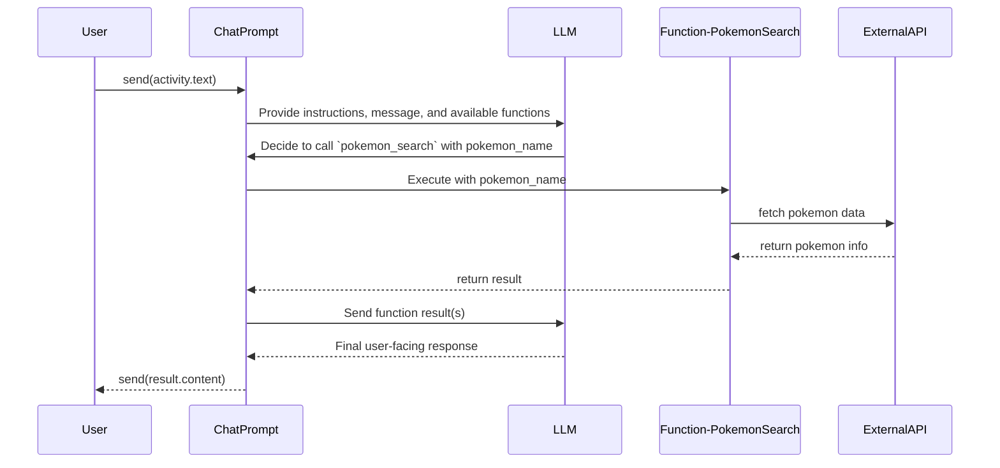

<!-- adding-functions -->

adding a `function` to the `ChatPrompt`

<!-- sequence-diagram -->



<!-- single-function-example -->

```python
import aiohttp
import random
from microsoft.teams.ai import Agent, Function
from microsoft.teams.api import MessageActivity, MessageActivityInput
from microsoft.teams.apps import ActivityContext
from microsoft.teams.openai import OpenAICompletionsAIModel
from pydantic import BaseModel

class SearchPokemonParams(BaseModel):
    pokemon_name: str
    """The name of the pokemon."""

async def pokemon_search_handler(params: SearchPokemonParams) -> str:
    """Search for Pokemon using PokeAPI - matches documentation example"""
    try:
        async with aiohttp.ClientSession() as session:
            async with session.get(f"https://pokeapi.co/api/v2/pokemon/{params.pokemon_name.lower()}") as response:
                if response.status != 200:
                    raise ValueError(f"Pokemon '{params.pokemon_name}' not found")

                data = await response.json()

                result_data = {
                    "name": data["name"],
                    "height": data["height"],
                    "weight": data["weight"],
                    "types": [type_info["type"]["name"] for type_info in data["types"]],
                }

                return f"Pokemon {result_data['name']}: height={result_data['height']}, weight={result_data['weight']}, types={', '.join(result_data['types'])}"
    except Exception as e:
        raise ValueError(f"Error searching for Pokemon: {str(e)}")

@app.on_message
async def handle_message(ctx: ActivityContext[MessageActivity]):
    openai_model = OpenAICompletionsAIModel(model=AZURE_OPENAI_MODEL)
    agent = Agent(model=openai_model)
    agent.with_function(
        Function(
            name="pokemon_search",
            description="Search for pokemon information including height, weight, and types",
            # Include the schema of the parameters
            # the LLM needs to return to call the function
            parameter_schema=SearchPokemonParams,
            handler=pokemon_search_handler,
        )
    )

    chat_result = await agent.send(
            input=ctx.activity.text,
            instructions="You are a helpful assistant that can look up Pokemon for the user.",
        )

    if chat_result.response.content:
        message = MessageActivityInput(text=chat_result.response.content).add_ai_generated()
        await ctx.send(message)
    else:
        await ctx.reply("Sorry I could not find that pokemon")
```

<!-- multiple-functions -->

## Multiple functions

Additionally, for complex scenarios, you can add multiple functions to the `ChatPrompt`. The LLM will then decide which function to call based on the context of the conversation. The LLM can pick one or more functions to call before returning the final response.

```python
import random
from microsoft.teams.ai import Agent, Function
from microsoft.teams.api import MessageActivity, MessageActivityInput
from microsoft.teams.apps import ActivityContext
from pydantic import BaseModel
# ...

class GetLocationParams(BaseModel):
    """No parameters needed for location"""
    pass

class GetWeatherParams(BaseModel):
    location: str
    """The location to get weather for"""

def get_location_handler(params: GetLocationParams) -> str:
    """Get user location (mock)"""
    locations = ["Seattle", "San Francisco", "New York"]
    location = random.choice(locations)
    return location

def get_weather_handler(params: GetWeatherParams) -> str:
    """Get weather for location (mock)"""
    weather_by_location = {
        "Seattle": {"temperature": 65, "condition": "sunny"},
        "San Francisco": {"temperature": 60, "condition": "foggy"},
        "New York": {"temperature": 75, "condition": "rainy"},
    }

    weather = weather_by_location.get(params.location)
    if not weather:
        return "Sorry, I could not find the weather for that location"

    return f"The weather in {params.location} is {weather['condition']} with a temperature of {weather['temperature']}°F"

@app.on_message
async def handle_multiple_functions(ctx: ActivityContext[MessageActivity]):
    agent = Agent(model)

    agent.with_function(
        Function(
            name="get_user_location",
            description="Gets the location of the user",
            parameter_schema=GetLocationParams,
            handler=get_location_handler,
        )
    ).with_function(
        Function(
            name="weather_search",
            description="Search for weather at a specific location",
            parameter_schema=GetWeatherParams,
            handler=get_weather_handler,
        )
    )

    chat_result = await agent.send(
        input=ctx.activity.text,
        instructions="You are a helpful assistant that can help the user get the weather. First get their location, then get the weather for that location.",
    )

    if chat_result.response.content:
        message = MessageActivityInput(text=chat_result.response.content).add_ai_generated()
        await ctx.send(message)
    else:
        await ctx.reply("Sorry I could not figure it out")
```
