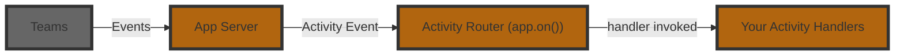

# Listening To Activities

An **Activity** is the Teams‑specific payload that flows between the user and your bot.
Where _events_ describe high‑level happenings inside your app, _activities_ are the raw Teams messages such as chat text, card actions, installs, or invoke calls.

<LanguageInclude section="intro" />

Here is an example of a basic message handler:

<LanguageInclude section="basic-example" />

<LanguageInclude section="example-explanation" />

## Middleware pattern

<LanguageInclude section="middleware-intro" />

<LanguageInclude section="middleware-examples" />

:::info
Just like other middlewares, if you stop the chain by not calling `next()`, the activity will not be passed to the next handler. The order of registration for the handlers also matters as that determines how the handlers will be called.
:::

<LanguageInclude section="activity-reference-footer" />
