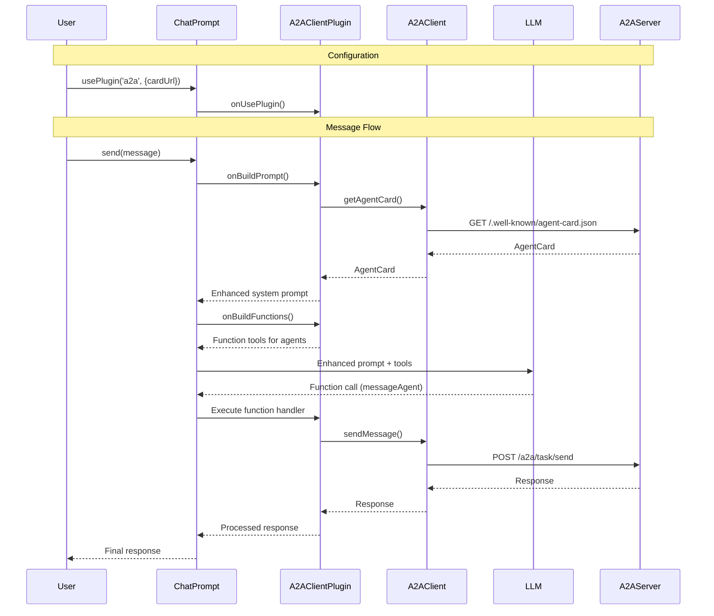

import FileCodeBlock from '@site/src/components/FileCodeBlock';

# A2A Client

## What is an A2A Client?

An A2A client is an agent or application that can proactively send tasks to A2A servers and interact with them using the A2A protocol.

## Using A2AClient Directly

For direct control over A2A interactions, you can use the `A2AClient` from the SDK:

<LanguageInclude section="direct-client" />

## Using A2AClientPlugin with ChatPrompt

A2A is most effective when used with an LLM. The `A2AClientPlugin` can be added to your chat prompt to allow interaction with A2A agents. Once added, the plugin will automatically configure the system prompt and tool calls to determine if the a2a server is needed for a particular task, and if so, it will do the work of orchestrating the call to the A2A server.

<LanguageInclude section="client-plugin" />

To send a message:

<LanguageInclude section="send-message" />

### Advanced A2AClientPlugin Configuration

You can customize how the client interacts with A2A agents by providing custom builders:

<LanguageInclude section="advanced-config" />

## Sequence Diagram

Here's how the A2A client works with `ChatPrompt` and `A2AClientPlugin`:

