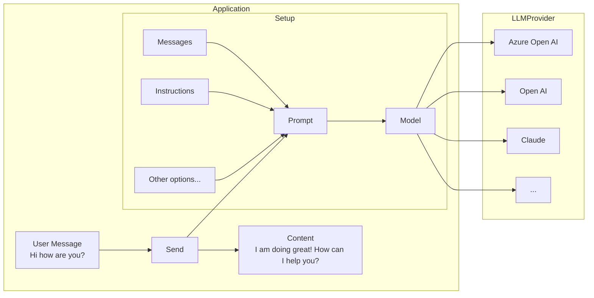

# 💬 Chat Generation

Before going through this guide, please make sure you have completed the [setup and prerequisites](./setup-and-prereqs.mdx) guide.

# Setup

The basic setup involves creating a `ChatPrompt` and giving it the `Model` you want to use.

## Simple chat generation

Chat generation is the the most basic way of interacting with an LLM model. It involves setting up your ChatPrompt, the Model, and sending it the message.

<LanguageInclude section="simple-chat-setup" />

<LanguageInclude section="simple-chat-code" />

<LanguageInclude section="declarative-approach" />

<LanguageInclude section="simple-chat-notes" />

<LanguageInclude section="additional-concepts" />

## Streaming chat responses

LLMs can take a while to generate a response, so often streaming the response leads to a better, more responsive user experience.

:::warning
Streaming is only currently supported for single 1:1 chats, and not for groups or channels.
:::

<LanguageInclude section="streaming-code" />

